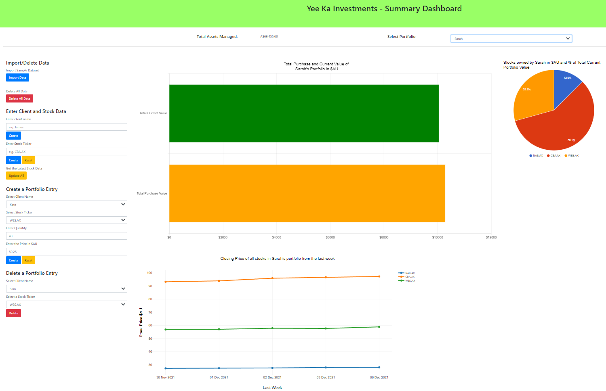

# Yee Ka Investments Stock Porfolios Dashboard
This web interactive dashboard is designed to help a potential fund manager to review the progress of the clients’ share portfolios using the latest data scraped from yahoo fiance using a custom python [module](yahoo_finance_etl_module_2.py).


And within each porfolio including
- a comparison the the total current value of a client's portfolio vs its original purchase value.
- what percentage each stock managed contributes to the total funds managed for the client.
- the closing stock prices of all the stocks in the client's portfolio from the last week.


It also allows for insertion, updating, and deletion of stock, portfolio, and client data.

## Tools/Packages used
- Python
  - Pandas
  - Pymongo
  - Flask
  - splinter
  - BeatuifulSoup
  - Selenium
  - numpy
  - datetime
  - time
  - bson
  - jinja
- Javascript
  - Bootstrap
  - D3
  - Plotly.js
  - Google Charts
  - Charts.js
- MongoDB
- HTML

## How to use
- Download the directory
- Open Git in the directory and type ``` python app.py ```
- Go to web address specified, usually `https://127.0.0.1:5000/`
